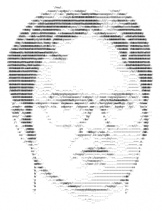

csvkit
========================================================
transition: rotate
author: Matt Pettis
date: 2015-03-07

<h1>Data^3 Conference</h1>
 

email: matthew.pettis@gmail.com

github: https://github.com/mpettis/csvkit_talk

Problems with CSV
========================================================
incremental: true

 

- What problems do you have, or have you seen with CSV?
    - This can be about the format, or about dealing with files in general
- Take a minute to come up with some of these problems
- What did you pull up?

Problems I've had with CSV
========================================================
incremental: true

 
- Blank cells when I was told that all cells would have values.
    - So, people lying to me.
- Missing header line when expected, or a header line when not expected.
- Not the same number of cells in a row as there are in the header.
- Improperly escaped commas or double-quotes
- Wrong kind of line ending for my OS
- Lots of files I have to sort through and make sense of.
- If an email references data in a small table, I hate having to open a separate file to look at the data.

Why Not Excel?
========================================================
incremental: true

- Well, you can.  And most people do.
- It is the right tool for some jobs.
- But some things can be done better...
- Let's look at some examples...

Alternates: Bash + custom tools
========================================================
incremental: true

- People smarter than me have had to deal with similar problems for decades, and have written tools.
    - `cat` : Dump a file to your screen
    - `head` and `tail` : Dump the beginnings and ends of files to screen.
    - `echo` : Copy strings you generate or type (not from a file usually) to the screen.
    - `less` : An interactive viewer for viewing a whole file, but stops all of the lines from just running off the top of the screen.
    - Control structures (`for`, `while`) : Allow you to apply your commands one at a time to each CSV file.
    - ... and many more.

Data in a proprietary binary format is better than plaintext
========================================================

 

***
 
FALSE.
The more available data is to user-chosen tools, the better off people are.
